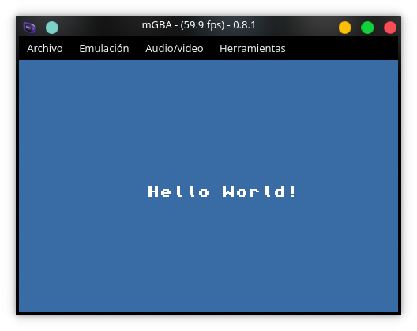

# GBA-Dev


This Repo contain my personal tests, and personal work for Nintendo GBA.

All source code and source resourses will be uploaded cause is my work.
-

# TOOLS

## Emulators and physical hardware

an most important part of the process into game dev for gba is have the environment of test for run your apps and games.

##### [mgba emulator](https://mgba.io/)

##### [Visualboy-advance](http://www.vbalink.info/download-gba-emulator.htm)

## DevKit Pro - DevKitGBA

Devkit is a provider of homebrew toolchains for Nintendo wii, gamecube, ds, gba, gamepark gp32 and Nintendo Switch.


[Devkitpro](https://devkitpro.org/)

#### DPK installation

first of all [follow the guide](https://devkitpro.org/wiki/Getting_Started), in case of Arch-linux which is an OS with pacman for packet manager the installation is simple. [Arch-installing](https://devkitpro.org/wiki/devkitPro_pacman#Customising_Existing_Pacman_Install)

after the installation you run this command:

```bash
sudo pacman -S gba-dev
```

the command only have success if you install properly DKP, this command install all resources needed for build your gba programs.

something for check all installation is copy this template that contain a basic code and files for build your game.

```bash
cp $DEVKITPRO/examples/gba/template <path/of/your/dev/dir> -r
cd <path/of/your/dev/dir>
make
visualboyadvance template.gba
```




## TONC

Tonc is a guide of the programing for GameBoy Advance (GBA), in this tutorial safe information of Video modes of gba, how works buttons, direct memory access, and others aspects.

[TONC](http://www.coranac.com/tonc/text/toc.htm)

## EverDrive GBA x5

The EverDrive is a flash-cart develop by [krikzz](https://krikzz.com/store/) that allow to do many things to the gba, like play back-up games or run own programs for this console


---
## Author
* **Cristian A. Murcia T.** [Cris-Mur](https://github.com/Cris-Mur/)