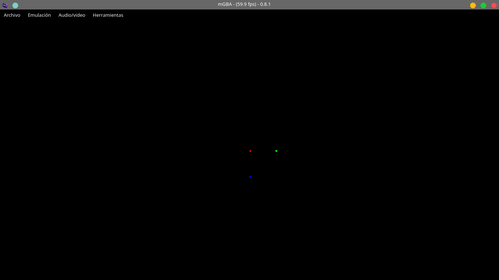

# First Demo



En la primera guía de tonc escribimos un programa para mostrar en pantalla 3 puntos de color, solo con esta simple premisa podemos aprender muchas cosas de la consola y de los retos que vendrán en la comprensión del funcionamiento de esta misma.

Para empezar nos damos cuenta que no utilizamos librerías (pronto)... denotando que nuestro programa no cargará nada absolutamente nada externo a lo que vamos a programar en las siguientes líneas.

Como en todo programa en c existe esta especial y única función llamada "main" sin parámetros... recomiendo que para antes de definir una función, método, rutina o lo que sea de este estilo comentemos una breve descripción de su funcionamiento, parámetros y retorno eso hace que el código sea mas profesional y sencillo de entender :D.

Dentro de esta función la primera línea de código es muy especial de por si.

## First line

```c
*(unsigned int*)0x04000000 = 0x0403;
```

Aunque en el código intenté explicar un poco esta línea voy a intentarlo esta vez con mas detalles empecemos.

***** tipo de dato: puntero... sabemos que un puntero es una variable donde almacenamos una dirección de memoria (referencia) en este caso este puntero guardará la dirección de un puntero de entero sin signo y su dirección explicita es  "0x04000000" algo así:

| (unsigned int *) 0x04000000 |
| :-------------------------: |
|              *              |

### 0x04000000 I / O RAM

PARA ESTE CASO SOLO NOS IMPORTAN LOS ESPACIOS QUE SE MODIFICAN de ESTA MEMORIA

|  F   |  E   |  D   |  C   |  B   |  A   |  9   |  8   |  7   |  6   |  5   |  4   |  3r  | 2 1 0 |
| :--: | :--: | :--: | :--: | :--: | :--: | :--: | :--: | :--: | :--: | :--: | :--: | :--: | :---: |
|  -   |  -   |  -   |  -   |  -   | BG2  |  -   |  -   |  -   |  -   |  -   |  -   |  -   | MODE  |
|  0   |  0   |  0   |  0   |  0   |  1   |  0   |  0   |  0   |  0   |  0   |  0   |  0   | 0 1 1 |

#### MODE

En GBA el "modo" hace referencia a una forma especial de interpretar la información para la pantalla de la consola. estas 3 cifras binarias disponibles en el espacio de modo nos indican de 7 estados posibles (solo por los dígitos) de los cuales 6 están realmente definidos, estos se enumeran del modo 0 al modo 5.

Para este caso usamos el modo 3.

#### BG2

En GBA existen 4 tipos de fondo que van del espacio 8 a B (derecha a izquierda), los fondos pueden verse como capas (como en photoshop) donde se pueden "dibujar" y mostrarse en pantalla.

Una forma para obtener estos valores es con su respectiva notación hexadecimal.

Ahora si podemos ir al resto de las líneas

## Second, third, fourth Line 

```c
((unsigned short*)0x06000000)[120+80*240] = 0x001F;
((unsigned short*)0x06000000)[136+80*240] = 0x03E0;
((unsigned short*)0x06000000)[120+96*240] = 0x7C00;
```

Esta vez pasa algo parecido que en la primera línea, asignamos un puntero de un **entero corto sin signo** todos inicialmente a la misma dirección de memoria **0x06000000**, aquí es donde viene la magia lo que está dentro de los paréntesis cuadrados es referencia a otro espacio de memoria a partir del inicial 0x06... es decir otro puntero, pero a cual espacio?? exactamente la cantidad de bloques que represente esa operación aritmética (en un momento la explico), y justo en ese espacio de memoria asignará el valor hexadecimal que representará el color.

### 0x06000000 VRAM

Podemos decir que en este momento la vram de cierta forma representa la pantalla de la GBA, la cuestión es que realmente en la memoria esta representación de la pantalla no es una matriz (x, y) es decir arreglos de arreglos sino una cadena, una sola fila de datos partiendo de (0,0) a (240, 160), ¿entonces como llegamos a esa posición? acá es donde nace la operación aritmética de antes **"[x + y * W]"** donde sumamos el par ordenado (x, y) y lo multiplicamos por el ancho de la pantalla es decir 240 de esta forma llegamos a la posición de la pantalla donde queremos estar.

#### Color

la pantalla de la GBA es capaz de mostrar tonalidades de colores RGB de 15 bit (en una variable de 16 porque una de 15 no es posible ;) ), esto significa que para cada píxel se pueden asignar valores a 15 espacios binarios, divididos en 3 segmentos.

|  x   | <span style="color:blue">B</span> | <span style="color:blue">B</span> | <span style="color:blue">B</span> | <span style="color:blue">B</span> | <span style="color:blue">B</span> | <span style="color:GREEN">G</span> | <span style="color:GREEN">G</span> | <span style="color:GREEN">G</span> | <span style="color:GREEN">G</span> | <span style="color:GREEN">G</span> | <span style="color:RED">R</span> | <span style="color:RED">R</span> | <span style="color:RED">R</span> | <span style="color:RED">R</span> | <span style="color:RED">R</span> |
| :--: | :-------------------------------: | :-------------------------------: | :-------------------------------: | :-------------------------------: | :-------------------------------: | :--------------------------------: | :--------------------------------: | :--------------------------------: | :--------------------------------: | :--------------------------------: | :------------------------------: | :------------------------------: | :------------------------------: | :------------------------------: | :------------------------------: |
|  0   |                 -                 |                 -                 |                 -                 |                 -                 |                 -                 |                 -                  |                 -                  |                 -                  |                 -                  |                 -                  |                -                 |                -                 |                -                 |                -                 |                -                 |

para cada color tenemos hasta 32 combinaciones posibles (5 bits) de 0 a 31 dando como resultado una paleta de 32.768 colores RGB posibles.