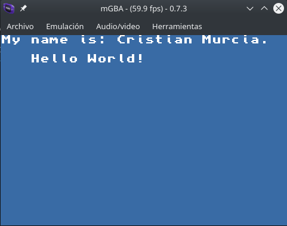

# Hello World

Using the template if Devkit-Gba for projects in gba.
## Description

Basic program and basic example that print in the screen ant string.

* For compile programs to GBA you need make a makefile for you project.

---

### [Hello world](./source/hello_world.c)
* File that contain code write in c lenguage.

### [Makefile](./Makefile)
* The makefiles are utilities in Unix like-systems that can compile and generate the correct form the executables for you project, this make files is provided by devkit.

---
## Screenshots

