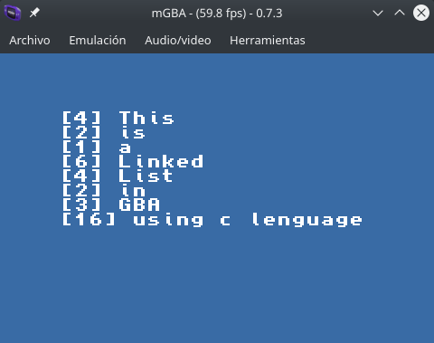

# Holberton Test

Using the template of Devkit-Gba for the projects in gba.

Port some exercises of Holberton School to the Gba programing using C lenguage.

## [holberton.c](./source/holberton.c)
* using the basic template, I port linked list exercise of holberton School.

### [Makefile](./Makefile)
* The makefiles are utilities in Unix like-systems that can compile and generate the correct form the executables for you project, this make files is provided by devkit.

---
## Screenshots

---
## Author
* **Cristian A. Murcia T.** [Cris-Mur](https://github.com/Cris-Mur/)